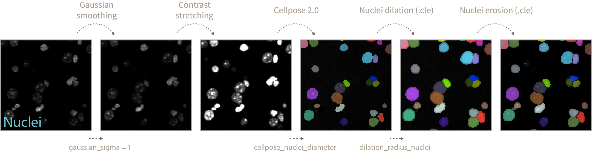
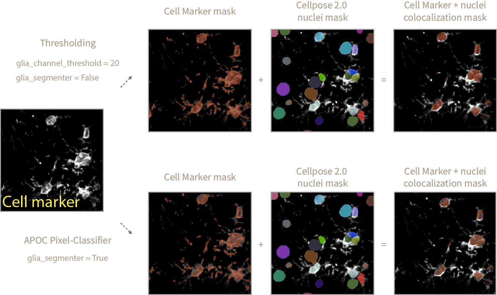

<h1>Counting Of Spots in Marker Indicator Cells (COSMIC)</h1>

This repository provides tools in the form of interactive Jupyter notebooks to count spots inside nuclei of cell marker positive and total cells. As an example we will be counting DNA damage foci inside microglia and astrocyte marker positive cells.

<h2>Instructions</h2>

1. Create a raw_data directory inside the microglia_dna_damage folder to store all of your acquired images. In our case .lsm files acquired with a Zeiss microscope. This particular tools works with 3-channel images but is easy to adapt to multiple channels.

2. (Optional) Train your own Object and Pixel (semantic) APOC classifiers to detect spots and cell marker as shown in 0_train_dna_damage_segmenter.ipynb and 0_train_glia_semantic_classifier.ipynb. An example of how to do that using Napari-Assistant can be found [here](https://github.com/adiezsanchez/intestinal_organoid_brightfield_analysis/blob/main/1_train_and_setup.ipynb).

3. Open 1_image_analysis.ipynb and define the analysis parameters. Here's an explanation of what each parameter means and does during the analysis pipeline:

<h3>Nuclei segmentation</h3>

1. Gaussian smoothing blurs the input nuclei image so later on the Cellpose algorithm does not focus in bright spots inside the nuclei as separate objects. The amount of blurrying/smoothing can be controlled by the <code>gaussian_sigma</code> parameter (default = 1).

The higher the gaussian_sigma values the increased chance of close sitting nuclei being detected as a single entity during Cellpose segmentation (see bright green nuclei below, gaussian_sigma = 6). On the other hand very low gaussian_sigma can result in incorrect segmentations or loss of nuclei entities. You will have to manually adjust this value according to your images.

2. After gaussian smoothing a normalization step of contrast stretching is applied so Cellpose segmentation does not focus in dimmer vs more intense nuclei and misses detection of some.

3. During Cellpose 2.0 nuclei segmentation you can define the <code>cellpose_nuclei_diameter</code> values. This value corresponds to the diameter in pixels of the nuclei present in your image. Helps Cellpose adjust nuclei mask predictions.

4. After nuclei prediction and using [.cle](https://github.com/clEsperanto/pyclesperanto_prototype) functions, we dilate nuclei labels to make sure the spots we want to quantify are sitting inside or touching the nuclei mask. You can define the amount of dilation by modifying the <code>dilation_radius_nuclei</code> value.

5. Finally a nuclei label erosion of radius 1 is performed to avoid merging touching nuclei objects upon eventual binarization steps.

<h3>Cell marker segmentation</h3>

1. In order to define the cell marker mask you can follow two approaches:

- A simple thresholding approach, where any pixel above a threshold value (<code>glia_channel_threshold</code>) is considered as positive cell marker signal. This approach works well if you have a clear staining with minimum background and not much variation of intensities across samples.

- A pretrained [APOC-based](https://github.com/haesleinhuepf/apoc) pixel-classifier that defines what is cell marker signal and what is background. This approach works well to generalize what is cell marker signal across samples with varying levels of intensities and noise. You can train your own APOC Pixel Classifier using 0_train_glia_semantic_classifier.ipynb.

2. To use the thresholding approach define the pixel value above which any signal is considered as cell marker set <code>glia_channel_threshold</code> to your desired value and set <code>glia_segmenter = False</code>.

3. Alternatively, set <code>glia_segmenter = True</code> and use the pixel-classifier. Take into account that the pixel-classifier might not be as accurate (it is designed to generalize) as the thresholding method and you will need to adjust the <code>glia_nuclei_colocalization_erosion</code> value (see next steps).

<h3>Cell Marker+ (CM+) nuclei definition</h3>

1. Once you have decided on a method for cell marker segmentation you would have obtained a Cell Marker + nuclei colocalization mask defining the areas of the image where the cell marker signal is sitting on top of a nuclei.

2. In the case of microglia and astrocytic cells (our example) there are cell protrusions that might sit on top of a nuclei that does not correspond to a Cell Marker positive cell (since our input image is a stack from multiple planes that is flattened via maximum intensity projection). In order to get rid of those unwanted regions we perform an erosion of the colocalization mask. The erosion extent is defined by the <code>glia_nuclei_colocalization_erosion</code> variable. The higher the value, the stricter the conditions to consider a nuclei as CM+. Too high values will result in the complete absence of CM+ nuclei.

3. Once the erosion operation is complete we check which Cellpose 2.0 detected nuclei objects sit on top of the eroded colocalization mask and mark those as CM+ nuclei. Afterwards we perform the same nuclei dilation and erosion steps defined in the Nuclei segmentation section.

<h3>Spot detection</h3>

<h2>Environment setup instructions</h2>

1. In order to run these Jupyter notebooks and .py scripts you will need to familiarize yourself with the use of Python virtual environments using Mamba. See instructions [here](https://biapol.github.io/blog/mara_lampert/getting_started_with_mambaforge_and_python/readme.html).

2. Then you will need to create a virtual environment using the command below or from the .yml file in the envs folder (recommended, see step 3):

   <code>mamba create -n microglia python=3.9 devbio-napari cellpose pytorch torchvision plotly pyqt -c conda-forge -c pytorch</code>

3. To recreate the venv from the environment.yml file stored in the envs folder (recommended) navigate into the envs folder using <code>cd</code> in your console and then execute:

   <code>mamba env create -f environment.yml</code>

4. Activate it by typing in the console:

   <code>mamba activate microglia</code>

5. Then launch Jupyter lab to interact with the code by typing:

   <code>jupyter lab</code>
