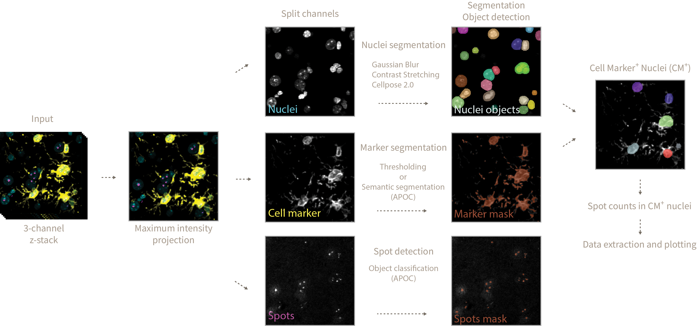

<h1>Counting Of Spots in Marker Indicator Cells (COSMIC)</h1>

This repository provides tools in the form of interactive Jupyter notebooks to count spots inside nuclei of cell marker positive and total cells. As an example we will be counting DNA damage foci inside microglia and astrocyte marker positive cells.

<h2>Instructions</h2>

1. Create a raw_data directory inside the microglia_dna_damage folder to store all of your acquired images. In our case .lsm files acquired with a Zeiss microscope. This particular tools works with 3-channel images but is easy to adapt to multiple channels.

2. (Optional) Train your own Object and Pixel (semantic) APOC classifiers to detect spots and cell marker as shown in 0_train_dna_damage_segmenter.ipynb and 0_train_glia_semantic_classifier.ipynb. An example of how to do that using Napari-Assistant can be found [here](https://github.com/adiezsanchez/intestinal_organoid_brightfield_analysis/blob/main/1_train_and_setup.ipynb).

3. Open 1_image_analysis.ipynb and define the analysis parameters. Here's an explanation of what each parameter means and does:

<h2>Environment setup instructions</h2>

1. In order to run these Jupyter notebooks and .py scripts you will need to familiarize yourself with the use of Python virtual environments using Mamba. See instructions [here](https://biapol.github.io/blog/mara_lampert/getting_started_with_mambaforge_and_python/readme.html).

2. Then you will need to create a virtual environment using the following command or from the yml file in the envs folder (recommended, see step 3):

   <code>mamba create -n microglia python=3.9 devbio-napari cellpose pytorch torchvision plotly pyqt -c conda-forge -c pytorch</code>

3. To recreate the venv from the environment.yml file stored in the envs folder (recommended) navigate into the envs folder using <code>cd</code> in your console and then execute:

   <code>mamba env create -f environment.yml</code>

4. Activate it by typing in the console:

   <code>mamba activate microglia</code>

5. Then launch Jupyter lab to interact with the code by typing:

   <code>jupyter lab</code>
